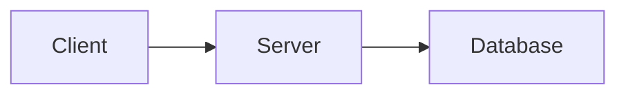

# obsidian-mermaid-mcp

[](LICENSE)
[](https://nodejs.org)
[](https://modelcontextprotocol.io)
[](README.md)

> **Local, Zero-Token, Lossless Mermaid rendering and reversible note synchronization for Obsidian vaults across all AI Agents.**
> 本地化、零 Token 消耗、完全可逆的 Obsidian Mermaid 渲染与同步服务，为任何 AI Agent 提供无感写作支持。

---

## 🌟 Highlights / 核心亮点

- ✍️ **Zero-Prompt Agent Writing / Agent 零提示词无感写作**
  AI Agents (Codex, Claude Code, Antigravity, Cursor, Windsurf, Cline, etc.) can write standard Markdown with `` ```mermaid `` code blocks naturally. The background Watcher automatically converts them to embedded SVGs within ~2 seconds.
- 🔒 **100% Local & Private / 纯本地渲染与隐私安全**
  Renders locally via headless Chrome/Puppeteer. No cloud rendering APIs, no token costs, and zero network leaks.
- 🔄 **Lossless & Fully Reversible / 无损与完全可逆**
  Original Mermaid code is safely preserved in both `.mmd` sidecar files and SVG `<metadata>`. Revert back to original Mermaid code blocks anytime with one click.
- 🧠 **Smart Vault Adaptation / 智能感知 Vault 附件结构**
  Automatically detects `.obsidian/app.json` (supports folder-relative `assets/${filename}`, vault-root `attachments`, and same-folder setups) with zero configuration.
- ⚡ **Dual Operation Modes / 双运行模式**
  1. **Automatic Watcher Mode** (background file watcher for seamless authoring)
  2. **MCP Tool Mode** (4 standard stdio MCP tools for direct Agent invocation)
- 💻 **Cross-Platform Support / 全平台支持**
  macOS, Linux, Windows, WSL, and Docker.

---

## 🚀 Quick Start / 快速开始

### Requirements / 环境依赖
- **Node.js**: `>= 20.0.0`
- **Chrome / Chromium / Edge / Brave**: Installed in a standard location, or specify via `PUPPETEER_EXECUTABLE_PATH`.

### Installation / 安装与构建
```bash
git clone https://github.com/your-username/obsidian-mermaid-mcp.git
cd obsidian-mermaid-mcp
npm ci
npm run build
npm test
```

---

## 🛠️ Usage Mode 1: Automatic Watcher (Recommended) / 模式一：自动监听模式（推荐）

Run the watcher in the background to automatically convert any newly written or edited Mermaid blocks in your Obsidian notes.

### Foreground Test / 前台测试运行
```bash
node packages/watcher/dist/index.js watch \
  --vault-root /path/to/your/obsidian/vault \
  --apply \
  --debounce-ms 2000
```
> **Note**: `--apply` is required for actual file writes. Without `--apply`, the watcher operates in preview-only mode.

### Background Daemon Setup / 跨平台开机常驻服务
We provide ready-to-use background service templates for all major platforms:

- **macOS (LaunchAgent)**: See [`examples/daemons/com.obsidian-mermaid.watch.plist`](examples/daemons/com.obsidian-mermaid.watch.plist)
- **Linux (systemd user service)**: See [`examples/daemons/obsidian-mermaid-watch.service`](examples/daemons/obsidian-mermaid-watch.service)
- **Windows (Task Scheduler / PowerShell)**: See [`examples/daemons/register-task-windows.bat`](examples/daemons/register-task-windows.bat)

👉 **Detailed Setup Guide**: [`docs/daemon-setup.md`](docs/daemon-setup.md)

---

## 🔌 Usage Mode 2: MCP Tool Mode / 模式二：MCP 客户端工具模式

Configure `obsidian-mermaid-mcp` as a standard MCP server in your favorite AI host.

### MCP Configuration Example / MCP 配置示例

```json
{
  "mcpServers": {
    "obsidian-mermaid": {
      "command": "node",
      "args": ["/absolute/path/to/obsidian-mermaid-mcp/packages/mcp-server/dist/index.js"],
      "env": {
        "OBSIDIAN_MERMAID_VAULT_ROOT": "/absolute/path/to/your/vault"
      }
    }
  }
}
```

👉 **Complete Configuration Guide for 10+ AI Hosts (Codex, Claude Code, Cursor, Windsurf, Cline, Roo Code, Goose, Zed, etc.)**:
See [`docs/host-configs.md`](docs/host-configs.md).

### Available MCP Tools / 工具列表

| Tool 名称 | Default 行为 | Description / 作用 |
| :--- | :--- | :--- |
| `sync_note` | preview | 扫描笔记中的 Mermaid 代码块，渲染为 SVG 并写入嵌入标记（需 `apply: true` 写入）。 |
| `restore_note` | preview | 将笔记中的嵌入 SVG 标记一键无损还原回原始 Mermaid 代码块。 |
| `render_mermaid` | read-only | 单独渲染一段 Mermaid 源码为 SVG。 |
| `extract_mermaid_source`| read-only | 从笔记或指定 SVG 中提取/恢复 Mermaid 源码。 |

---

## 📁 How It Works: Vault Transformation / 转换效果与结构

### Before Conversion / 写入前 (Standard Markdown)
````markdown
# Architecture Overview


````

### After Conversion / 转换后 (Embedded SVG + Sidecar)
```markdown
# Architecture Overview

<!-- obsidian-mermaid-mcp:v1 {"id":"mm-a1b2c3","svg":"assets/Architecture/mermaid-001-f974.svg","source":"assets/Architecture/mermaid-001-f974.mmd","hash":"f974..."} -->
![[assets/Architecture/mermaid-001-f974.svg|600]]
```

### Generated Files / 生成的文件
```text
MyVault/
├── Architecture.md
└── assets/
    └── Architecture/
        ├── mermaid-001-f974.svg   # Sanitized, high-resolution SVG
        └── mermaid-001-f974.mmd   # Exact Mermaid source backup
```

---

## ⚙️ Configuration Reference / 配置参考

You can customize behavior via a JSON configuration file (`--config /path/to/config.json`) or environment variables.

Example `config.json`:
```json
{
  "configVersion": 1,
  "vaultRoot": "/path/to/vault",
  "assetRoot": "assets",
  "attachmentPattern": "{note_dir}/assets/{note_name}/mermaid-{index}-{hash}.svg",
  "sourcePattern": "{note_dir}/assets/{note_name}/mermaid-{index}-{hash}.mmd",
  "embedWidth": 600,
  "theme": "default",
  "background": "transparent",
  "sourceStorage": "both",
  "failurePolicy": "partial",
  "renderer": {
    "timeoutMs": 30000,
    "browserIdleTimeoutMs": 300000,
    "maxConcurrentRenders": 1,
    "htmlLabels": false,
    "securityLevel": "strict",
    "executablePath": ""
  },
  "watcher": {
    "enabled": true,
    "debounceMs": 2000,
    "apply": true
  }
}
```

### Template Placeholders / 路径模板变量
- `{note_dir}`: Subdirectory of the note relative to vault root (e.g. `SEM_AI/chapter1` or empty for root notes).
- `{note_name}`: Safe filename of the note without `.md` extension.
- `{asset_root}`: Configured asset root (default: `assets`).
- `{index}`: 3-digit index of the diagram within the note (`001`, `002`, etc.).
- `{hash}`: 16-character SHA-256 fingerprint of the Mermaid source.
- `{ext}`: File extension (`svg` or `mmd`).

---

## 🔍 Troubleshooting & FAQ / 常见问题

### 1. Browser not found / 找不到 Chrome 浏览器
By default, the server searches standard macOS, Linux, and Windows directories for Google Chrome, Chromium, Microsoft Edge, Brave, or Arc. If you have installed browser in a custom location, set:
```bash
export PUPPETEER_EXECUTABLE_PATH="/custom/path/to/chrome"
```
Or specify `"renderer.executablePath"` in your `config.json`.

### 2. Dark theme support / 深色主题适配
Set `"theme": "dark"` in `config.json` or pass `"theme": "dark"` in MCP tool calls. You can also use `"theme": "auto"` with `"themeContext": "dark"`.

### 3. How to edit an already converted diagram / 如何修改已转换的图表
- **Option A**: Run `restore_note` (via MCP or CLI) to restore the note back to ` ```mermaid ` code blocks, edit it, and let it re-sync.
- **Option B**: Directly edit the generated `.mmd` sidecar file in the `assets/` folder. The Watcher / Sync engine will automatically detect the sidecar change and regenerate the SVG!

---

## 📄 License

MIT License. See [`LICENSE`](LICENSE) for details.
