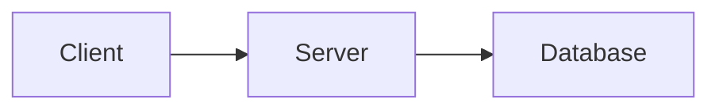

# obsidian-mermaid-mcp

<p align="left">
  <a href="README.md"><b>English</b></a> | <a href="README.zh-CN.md"><b>简体中文</b></a>
</p>

[](LICENSE)
[](https://nodejs.org)
[](https://modelcontextprotocol.io)
[](README.md)

> **Local, Zero-Token, Lossless Mermaid rendering and reversible note synchronization for Obsidian vaults across all AI Agents.**

---

## 🌟 Key Highlights

- ✍️ **Zero-Prompt Agent Writing Experience**
  AI Agents (Codex, Claude Code, Antigravity, Cursor, Windsurf, Cline, etc.) can write standard Markdown with `` ```mermaid `` code blocks naturally. The background Watcher automatically converts them to embedded SVGs within ~2 seconds without requiring special prompts.
- 🔒 **100% Local & Private**
  Renders locally via headless Chrome/Puppeteer. No cloud rendering APIs, no token costs, and zero network leaks.
- 🔄 **Lossless & Fully Reversible**
  Original Mermaid code is safely preserved in both `.mmd` sidecar files and SVG `<metadata>`. Revert back to original Mermaid code blocks anytime with one click.
- 🧠 **Smart Vault Adaptation**
  Automatically detects `.obsidian/app.json` (supports folder-relative `assets/${filename}`, vault-root `attachments`, and same-folder setups) with zero configuration.
- ⚡ **Dual Operation Modes**
  1. **Automatic Watcher Mode** (background file watcher for seamless authoring)
  2. **MCP Tool Mode** (4 standard stdio MCP tools for direct Agent invocation)
- 💻 **Universal Platform Support**
  macOS, Linux, Windows, WSL, and Docker.

---

## 🚀 Quick Start

### Requirements
- **Node.js**: `>= 20.0.0`
- **Chrome / Chromium / Edge / Brave / Arc**: Installed in a standard location, or specify via `PUPPETEER_EXECUTABLE_PATH`.

### Installation & Build (Local Node.js)
```bash
git clone https://github.com/IPromise-23/obsidian-mermaid-mcp.git
cd obsidian-mermaid-mcp
npm ci
npm run build
npm test
```

### Installation & Build (Docker Alternative)
```bash
git clone https://github.com/IPromise-23/obsidian-mermaid-mcp.git
cd obsidian-mermaid-mcp
docker build -t obsidian-mermaid-mcp:latest .
```
👉 **Detailed Docker Guide (MCP Server & Docker Compose)**: [`docs/docker-guide.md`](docs/docker-guide.md)

---

## 🛠️ Usage Mode 1: Automatic Watcher (Recommended)

Run the watcher in the background to automatically convert any newly written or edited Mermaid blocks in your Obsidian notes.

### Foreground Test
```bash
node packages/watcher/dist/index.js watch \
  --vault-root /path/to/your/obsidian/vault \
  --apply \
  --debounce-ms 3000
```
> **Note**: `--apply` is required for actual file writes. Without `--apply`, the watcher operates in preview-only mode.

### Background Daemon Setup
We provide ready-to-use background service templates for all major platforms:

- **macOS (LaunchAgent)**: See [`examples/daemons/com.obsidian-mermaid.watch.plist`](examples/daemons/com.obsidian-mermaid.watch.plist)
- **Linux (systemd user service)**: See [`examples/daemons/obsidian-mermaid-watch.service`](examples/daemons/obsidian-mermaid-watch.service)
- **Windows (Task Scheduler / PowerShell)**: See [`examples/daemons/register-task-windows.bat`](examples/daemons/register-task-windows.bat)

👉 **Detailed Daemon Setup Guide**: [`docs/daemon-setup.md`](docs/daemon-setup.md)

---

## 🔌 Usage Mode 2: MCP Tool Mode

Configure `obsidian-mermaid-mcp` as a standard MCP server in your favorite AI host.

### MCP Configuration Example

```json
{
  "mcpServers": {
    "obsidian-mermaid": {
      "command": "node",
      "args": ["/absolute/path/to/obsidian-mermaid-mcp/packages/mcp-server/dist/index.js"],
      "env": {
        "OBSIDIAN_MERMAID_VAULT_ROOT": "/absolute/path/to/your/vault"
      }
    }
  }
}
```

👉 **Complete Configuration Guide for 10+ AI Hosts (Codex, Claude Code, Cursor, Windsurf, Cline, Roo Code, Goose, Zed, etc.)**:
See [`docs/host-configs.md`](docs/host-configs.md).

### Available MCP Tools

| Tool Name | Default Mode | Description |
| :--- | :--- | :--- |
| `sync_note` | preview | Scan Mermaid fences in a note, render to SVG, and insert embed markers (requires `apply: true` to write). |
| `restore_note` | preview | Restore managed SVG embed markers back to original Mermaid code fences. |
| `render_mermaid` | read-only | Render raw Mermaid source to sanitized SVG. |
| `extract_mermaid_source` | read-only | Extract or recover Mermaid source from a note or managed SVG file. |

---

## 📁 How It Works: Vault Transformation

### Before Conversion (Standard Markdown)
````markdown
# Architecture Overview


````

### After Conversion (Clean Embedded SVG + Sidecar)
```markdown
# Architecture Overview

![[assets/Architecture/mermaid-001-f97437d9e714d8ee.svg|600]]
```

### Generated File Structure
```text
MyVault/
├── Architecture.md
└── assets/
    └── Architecture/
        ├── mermaid-001-f974.svg   # Sanitized, high-resolution SVG
        └── mermaid-001-f974.mmd   # Exact Mermaid source backup
```

---

## ⚙️ Configuration Reference

You can customize behavior via a JSON configuration file (`--config /path/to/config.json`) or environment variables.

Example `config.json`:
```json
{
  "configVersion": 1,
  "vaultRoot": "/path/to/vault",
  "assetRoot": "assets",
  "attachmentPattern": "{note_dir}/assets/{note_name}/mermaid-{index}-{hash}.svg",
  "sourcePattern": "{note_dir}/assets/{note_name}/mermaid-{index}-{hash}.mmd",
  "embedWidth": 600,
  "theme": "default",
  "background": "transparent",
  "sourceStorage": "both",
  "failurePolicy": "partial",
  "renderer": {
    "timeoutMs": 30000,
    "browserIdleTimeoutMs": 300000,
    "maxConcurrentRenders": 1,
    "htmlLabels": false,
    "securityLevel": "strict",
    "executablePath": ""
  },
  "watcher": {
    "enabled": true,
    "debounceMs": 3000,
    "apply": true
  }
}
```

### Template Placeholders
- `{note_dir}`: Subdirectory of the note relative to vault root (e.g. `SEM_AI/chapter1` or empty for root notes).
- `{note_name}`: Safe filename of the note without `.md` extension.
- `{asset_root}`: Configured asset root (default: `assets`).
- `{index}`: 3-digit index of the diagram within the note (`001`, `002`, etc.).
- `{hash}`: 16-character SHA-256 fingerprint of the Mermaid source.
- `{ext}`: File extension (`svg` or `mmd`).

---

## 🔍 Troubleshooting & FAQ

### 1. Browser not found
By default, the server searches standard macOS, Linux, and Windows directories for Google Chrome, Chromium, Microsoft Edge, Brave, or Arc. If installed in a custom location, set:
```bash
export PUPPETEER_EXECUTABLE_PATH="/custom/path/to/chrome"
```
Or specify `"renderer.executablePath"` in your `config.json`.

### 2. Dark theme support
Set `"theme": "dark"` in `config.json` or pass `"theme": "dark"` in MCP tool calls. You can also use `"theme": "auto"` with `"themeContext": "dark"`.

### 3. How to edit an already converted diagram
- **Option A**: Run `restore_note` (via MCP or CLI) to restore the note back to ` ```mermaid ` code blocks, edit it, and let it re-sync.
- **Option B**: Directly edit the generated `.mmd` sidecar file in the `assets/` folder. The Watcher / Sync engine will automatically detect the sidecar change and regenerate the SVG!

---

## 📄 License

MIT License. See [`LICENSE`](LICENSE) for details.
