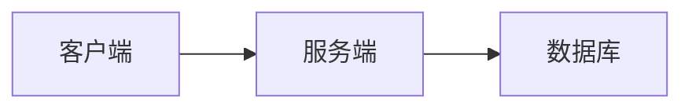

# obsidian-mermaid-mcp

<p align="left">
  <a href="README.md"><b>English</b></a> | <a href="README.zh-CN.md"><b>简体中文</b></a>
</p>

[](LICENSE)
[](https://nodejs.org)
[](https://modelcontextprotocol.io)
[](README.zh-CN.md)

> **本地化、零 Token 消耗、完全可逆的 Obsidian Mermaid 渲染与同步服务，为任何 AI Agent 提供无感写作支持。**

---

## 🌟 核心亮点

- ✍️ **Agent 零提示词无感写作**
  AI Agent（Codex、Claude Code、Antigravity、Cursor、Windsurf、Cline 等）在 Obsidian 中照常撰写包含 `` ```mermaid `` 的 Markdown 笔记即可。后台 Watcher 会在保存后约 2 秒内自动将其渲染为 SVG 并原地替换嵌入，无需在提示词中附加工具调用指令。
- 🔒 **纯本地渲染与隐私安全**
  通过本地 Headless Chrome / Puppeteer 渲染，不依赖任何第三方云端渲染 API，零 Token 额外开销，绝对保护您的笔记与知识库隐私。
- 🔄 **无损与完全可逆**
  Mermaid 原始源码会在 `.mmd` 副文件与 SVG `<metadata>` 中进行双重备份。通过 `restore_note` 可随时一键无损还原回原始 Mermaid 代码块。
- 🧠 **智能感知 Vault 附件结构**
  自动探测并适配 `.obsidian/app.json` 配置（完美支持 `assets/${filename}`、根目录 `attachments` 以及同级目录等各类附件管理方式），做到零配置开箱即用。
- ⚡ **双运行模式**
  1. **自动监听模式（Watcher）**：后台常驻守护进程，Agent 写作无感自动转换。
  2. **MCP 工具模式**：提供 4 个标准 stdio MCP 工具供 Agent 直接调用。
- 💻 **全平台通用支持**
  完美支持 macOS, Linux, Windows, WSL 以及 Docker 环境。

---

## 🚀 快速开始

### 环境依赖
- **Node.js**: `>= 20.0.0`
- **Chrome / Chromium / Edge / Brave / Arc**: 安装在系统默认路径即可，亦可通过 `PUPPETEER_EXECUTABLE_PATH` 手动指定。

### 安装与构建（本地 Node.js 方式）
```bash
git clone https://github.com/IPromise-23/obsidian-mermaid-mcp.git
cd obsidian-mermaid-mcp
npm ci
npm run build
npm test
```

### 安装与构建（Docker 容器化方式，免装 Node/Chrome）
```bash
git clone https://github.com/IPromise-23/obsidian-mermaid-mcp.git
cd obsidian-mermaid-mcp
docker build -t obsidian-mermaid-mcp:latest .
```
👉 **详细 Docker 使用手册（MCP Server 与 Docker Compose 后台常驻）**：[`docs/docker-guide.md`](docs/docker-guide.md)

---

## 🛠️ 模式一：自动监听模式（推荐）

在后台启动 Watcher 监听进程，它会自动捕获 Obsidian Vault 中笔记的变动并完成转换。

### 前台测试运行
```bash
node packages/watcher/dist/index.js watch \
  --vault-root /path/to/your/obsidian/vault \
  --apply \
  --debounce-ms 3000
```
> **提示**：`--apply` 是执行写入的关键参数。不加 `--apply` 时 Watcher 仅为预览模式（不修改磁盘文件）。

### 后台开机常驻服务配置
我们为三大主流平台提供了开箱即用的后台服务模板：

- **macOS (LaunchAgent)**: 参考 [`examples/daemons/com.obsidian-mermaid.watch.plist`](examples/daemons/com.obsidian-mermaid.watch.plist)
- **Linux (systemd user service)**: 参考 [`examples/daemons/obsidian-mermaid-watch.service`](examples/daemons/obsidian-mermaid-watch.service)
- **Windows (任务计划程序 / PowerShell)**: 参考 [`examples/daemons/register-task-windows.bat`](examples/daemons/register-task-windows.bat)

👉 **详细配置指南请参考**：[`docs/daemon-setup.md`](docs/daemon-setup.md)

---

## 🔌 模式二：MCP 客户端工具模式

将 `obsidian-mermaid-mcp` 配置到您常用的 AI 客户端中作为标准 MCP Server 使用。

### MCP 配置示例

```json
{
  "mcpServers": {
    "obsidian-mermaid": {
      "command": "node",
      "args": ["/absolute/path/to/obsidian-mermaid-mcp/packages/mcp-server/dist/index.js"],
      "env": {
        "OBSIDIAN_MERMAID_VAULT_ROOT": "/absolute/path/to/your/vault"
      }
    }
  }
}
```

👉 **涵盖 10+ 款主流 Agent（Codex、Claude Code、Cursor、Windsurf、Cline、Roo Code、Goose、Zed 等）的配置指南**：
请查阅 [`docs/host-configs.md`](docs/host-configs.md)。

### MCP 工具列表

| 工具名称 | 默认行为 | 作用 |
| :--- | :--- | :--- |
| `sync_note` | preview | 扫描笔记中的 Mermaid 代码块，渲染为 SVG 并写入嵌入标记（需 `apply: true` 写入）。 |
| `restore_note` | preview | 将笔记中的嵌入 SVG 标记一键无损还原回原始 Mermaid 代码块。 |
| `render_mermaid` | read-only | 单独渲染一段 Mermaid 源码为 SVG。 |
| `extract_mermaid_source`| read-only | 从笔记或指定 SVG 中提取/恢复 Mermaid 源码。 |

---

## 📁 转换效果与目录结构

### 写入前 (标准 Markdown)
````markdown
# 系统架构概览


````

### 转换后 (纯净嵌入 SVG + 备份 Sidecar)
```markdown
# 系统架构概览

![[assets/系统架构概览/mermaid-001-f97437d9e714d8ee.svg|600]]
```

### 生成的目录与文件
```text
我的Obsidian仓库/
├── 系统架构概览.md
└── assets/
    └── 系统架构概览/
        ├── mermaid-001-f974.svg   # 安全、高清晰度矢量图
        └── mermaid-001-f974.mmd   # Mermaid 源码备份
```

---

## ⚙️ 配置参数参考

您可以通过 JSON 配置文件（`--config /path/to/config.json`）或环境变量自定义行为。

配置示例 `config.json`：
```json
{
  "configVersion": 1,
  "vaultRoot": "/path/to/vault",
  "assetRoot": "assets",
  "attachmentPattern": "{note_dir}/assets/{note_name}/mermaid-{index}-{hash}.svg",
  "sourcePattern": "{note_dir}/assets/{note_name}/mermaid-{index}-{hash}.mmd",
  "embedWidth": 600,
  "theme": "default",
  "background": "transparent",
  "sourceStorage": "both",
  "failurePolicy": "partial",
  "renderer": {
    "timeoutMs": 30000,
    "browserIdleTimeoutMs": 300000,
    "maxConcurrentRenders": 1,
    "htmlLabels": false,
    "securityLevel": "strict",
    "executablePath": ""
  },
  "watcher": {
    "enabled": true,
    "debounceMs": 3000,
    "apply": true
  }
}
```

### 路径模板占位符说明
- `{note_dir}`：笔记相对于 Vault 根目录的子路径（如 `SEM_AI/chapter1`，根目录笔记时为空字符串）。
- `{note_name}`：笔记的安全文件名（去除 `.md` 后缀）。
- `{asset_root}`：配置的附件根目录（默认 `assets`）。
- `{index}`：该图表在当前笔记中的 3 位序号（`001`, `002` 等）。
- `{hash}`：Mermaid 源码的 16 位 SHA-256 指纹。
- `{ext}`：文件扩展名（`svg` 或 `mmd`）。

---

## 🔍 常见问题排查 (FAQ)

### 1. 找不到 Chrome 浏览器
默认情况下，服务会自动检索 macOS, Linux 与 Windows 常见路径下的 Google Chrome, Chromium, Microsoft Edge, Brave 或 Arc。若安装在自定义路径，可设置：
```bash
export PUPPETEER_EXECUTABLE_PATH="/自定义路径/chrome"
```
或在 `config.json` 中配置 `"renderer.executablePath"`。

### 2. 深色主题适配
在 `config.json` 中设置 `"theme": "dark"`，或在 MCP 工具调用时传入 `"theme": "dark"`。也可以使用 `"theme": "auto"` 配合 `"themeContext": "dark"`。

### 3. 如何修改已转换的图表
- **方式一**：通过 MCP 或 CLI 执行 `restore_note` 将笔记恢复为 ` ```mermaid ` 代码块，编辑后保存重新同步。
- **方式二**：直接在 `assets/` 目录下编辑对应的 `.mmd` 源码文件，Watcher / Sync 引擎会自动感知副文件变动并重新生成最新的 SVG！

---

## 📄 开源许可证

本项目基于 [MIT License](LICENSE) 协议开源。
